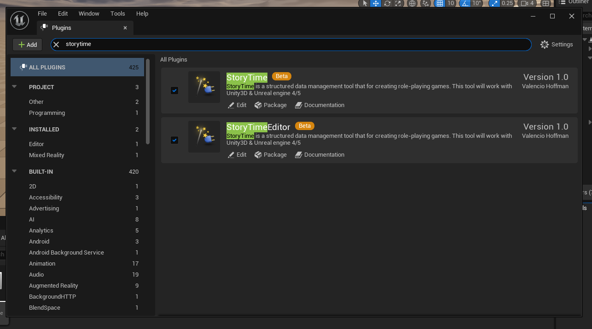

# StoryTime
Unreal engine 5 StoryTime plugin.

This is the Unreal 5 plugin to retrieve and parse data from the StoryTime app.
This plugin also provides components that developers can use to create RPG games.

## Prerequisites
* You must have git installed on your machine.

For more information check out our [Documentations](https://docs.vamidicreations.nl/)

## Getting Started
> Make sure if you use an (existing) project in Unreal engine 5 and generated the visual studio files.

### Adding the plugin
* If you don't have one, create a folder called "Plugins" in your project directory (where your content folder is located). 
* If you have a Plugins folder checkout the the plugin (or download the release) and copy the plugin to the Plugins folder.

### Setting up the config
* When you copied everything over to the plugins' folders, go to `StoryTimeEditor` > `Resources` > `Config` and copy/rename `config.json.example` to `config.json` 
* Put in all your info and credentials.

| Variable |  Default Value | Description                             |
| -------- | -------------- |-----------------------------------------|
| databaseURL | YOUR_WEB_SERVER_URL | Your web server to retrieve the data from |
| projectID | YOUR_PROJECT_ID | Your project id you want to use.        |
| email | YOUR_EMAIL_LOGIN | Your email credential to log into StoryTime. |
| password | YOUR_PASSWORD_LOGIN | Your password credential to log into StoryTime |
| dataPath | /ABSOLUTE/PATH/TO/YOUR/STORYTIME/PLUGIN/FOLDER/Content/Data | The location to store the JSON data in. |

### Adding and building all modules
* Rebuild your project/game
* Start your project in Visual Studio via "Launch via Local Debugger".
* If you get asked to build some modules, do it. 
* Once opened go to `Edit` > `Plugins` and search for StoryTime.

* Make sure they are both enabled.

* [OPTIONAL] Close Unreal Editor.
* [OPTIONAL] You can now open the game via the Launcher or the `.uproject` file.

* After filling all the necessary fields you can start syncing all the data.
* Look at the [documentations](https://docs.vamidicreations.nl) for more information on getting started with the components.

## Licence
The StoryTime is open-sourced software licensed under the [Apache 2.0](./LICENSE)

